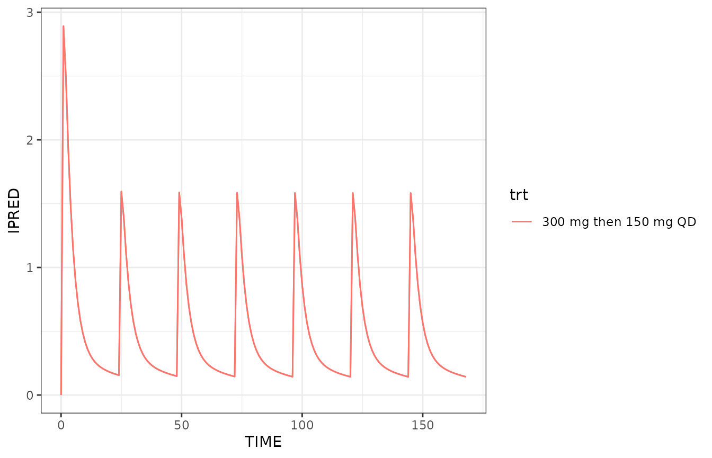

# Simulation of typical subjects

## This document is retired

This work has been integrated into
[`NMsim-intro.html`](https://nmautoverse.github.io/NMsim/articles/NMsim-intro.html)
and is no longer maintained.

## Objectives

This vignettes aims at enabling you to use `NMsim` for the following
purposes

- Simulation of typical subjects

## Simulation of a typical subject

A typical subject is here understood as a subject without random
effects, i.e. all ETA’s equal zero. It is important to realize that
“typical” does not have to do with covariates which the user will still
need to control in the model, in the simulation input data, or by a
combination of these. Getting `NMsim` to run with all ETA’s equaling
zero is this easy:

``` r
simres.typ <- NMsim(file.mod=file.mod,
                    data=dat.sim,
                    name.sim="typSubj",
                    typical=TRUE)
```

In the first simulation we used `PRED` from the default simulation
method to get a typical subject simulation. That will work in many
cases, but that depends on the model. The way to run a simulation with
all ETA’s set to 0 is using `method.sim=NMsim_typical`.

``` r
p.typ <- ggplot(simres.typ,aes(TIME,IPRED,color=trt))+geom_line()+
    geom_line(aes(y=PRED))
p.typ
```


