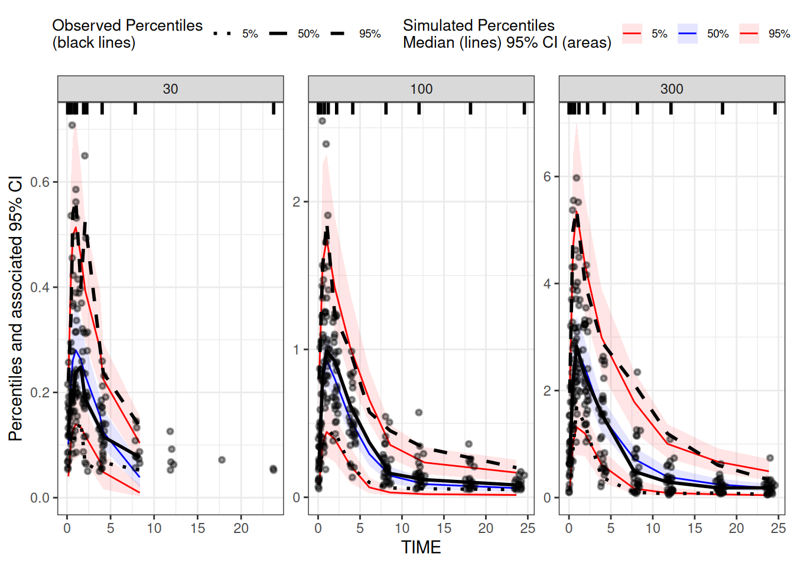
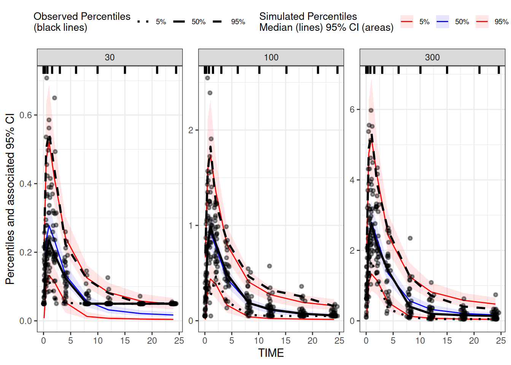

# VPC Simulations

## Simulations for Visual Predictive Checks (VPC)

This vignette shows how to generate simulations for generation of VPC
plots. While `NMsim` does not include any functionality for summarizing
quantiles or plotting, it provides a powerful and simple interface to
obtain the simulations. We shall see how the `tidyvpc` package easily
creates VPC plots based on the simulation results.

## Default Option: Reuse Estimation Data for Simulation

Normally, the two main arguments to
[`NMsim()`](https://nmautoverse.github.io/NMsim/reference/NMsim.md) are
the path to the input control stream (`file.mod`) and the simulation
input data set (`data`). But if we leave out the the `data` argument,
NMsim will re-use the estimation data for the simulation. That is the
simulation we need for a VPC. We will use an example model included with
NMsim:

``` r
file.mod <- system.file("examples/nonmem/xgxr032.mod",package="NMsim")
NMdataConf(path.nonmem="/opt/NONMEM/nm75/run/nmfe75")
NMdataConf(dir.sims="simtmp-VPC",
           dir.res="simres-VPC"
           )
```

``` r
## notice the data argument is not used.
simres.vpc <- NMsim(file.mod,
                    table.vars=c("PRED","IPRED", "Y"),
                    name.sim="vpc_01",
                    seed.R=43,
                    subproblems=500
                    )
```

The performed simulation is similar to the one produced by the `VPC`
function in `PSN`. However, there are some important differences.

- The simulation results are automatically read into R.

- The `table.vars` argument allows the user to narrow down the variables
  to be written to disk. This can speed up the simulation considerably
  and reduce the amount of disk space the Nonmem simulation results
  require.

- No postprocessing of the results is being done by `NMsim`. See below
  how to easily do that.

## Plotting using `tidyvpc`

As mentioned, `NMsim` does not postprocess the simulation for generation
of a VPC plot, nor does it offter any plotting functions. The R package
called `tidyvpc` offer those two things and is moreover implemented in
`data.table`, so it’s fast. The following simple code shows how to get
from the results from `NMsim` to the VPC plot with `tidyvpc`.

``` r
library(ggplot2)
library(tidyvpc)
#> tidyvpc is part of Certara.R!
#> Follow the link below to learn more about PMx R package development at Certara.
#> https://certara.github.io/R-Certara/
library(NMdata)
## read the data as it was used in the Nonmem model
res <- NMscanData(file.mod,quiet=TRUE)
## only plot observation events from estimation data set
data.obs <- subset(res,EVID==0)
## Only plot simulated observation events
data.sim <- subset(simres.vpc,EVID==0)

## run vpc
vpc1 <-
    observed(data.obs, x = TIME, y = DV) |>
    simulated(data.sim, y = Y) |>
    stratify(~DOSE) |>
    binning(bin = "ntile", nbins = 9) |>
    vpcstats()


plot(vpc1)
```



## Use a different input data set

In the first example we used the exact same data as was used for the
estimation. This is a common way to produce a VPC, and we saw the
advantage that the user does not risk making mistakes in preparing the
data set for the simulations. However, it may be of interest to include
additional data or even a different data set in the simulation. It could
be including data points that were excluded in estimation (like samples
below the quantification limit) or a separate study that was not
included in the model. There are at least two ways you can achieve this

- Change the ACCEPT/IGNORE statements for the simulation run  
  This is easy, and you still get the benefit of not reading the data,
  with risk of making mistakes when manually subsetting it.

- Read the input data set from the estimation model and subset
  manually  
  The manually subsetted data set is then passed to
  [`NMsim()`](https://nmautoverse.github.io/NMsim/reference/NMsim.md) in
  the `data` argument.

### Change the ACCEPT/IGNORE Statements

NMsim provides a simple interface to modify the data filters
(`ACCEPT`/`IGNORE`). First we read them into a data.frame.

``` r
filters <- NMreadFilters(file.mod,as.fun="data.table")
filters
```

There is an exclusion `FLAG.NE.0`. The way this is used in this case is
that FLAG is non-negative, besides 0 which is the analysis set,
`FLAG=10` is the smallest values, and that’s the BLQ’s. A more common
way to handle this would be to have an exclusion based on `BLQ.NE.0`.
Anyway, we simply edit that filter and re-run the simulation:

``` r
filters[cond=="FLAG.NE.0",cond:="FLAG.GT.10"]
filters

set.seed(43)
## notice the data argument is still not used.
simres.vpc.filters <- NMsim(file.mod,
                            table.vars=c("PRED","IPRED", "Y"),
                            name.sim="vpc_02",
                            subproblems=500,
                            filters=filters
                            )
```

The plotting can be done the same way. This time we extract the
observations from the simulation results (from the preserved `DV`
column, not from any of the simulated columns)

``` r
## read the data as it was used in the Nonmem model
res <- simres.vpc.filters[simres.vpc.filters$NMREP==1,]
## only plot observation events from estimation data set
data.obs <- subset(res,EVID==0)
## Only plot simulated observation events
data.sim <- subset(simres.vpc.filters,EVID==0)

## run vpc
vpc1 <-
    observed(data.obs, x = TIME, y = DV) |>
    simulated(data.sim, y = Y) |>
    stratify(~DOSE) |>
    binning(bin = "ntile", nbins = 9) |>
    vpcstats()


plot(vpc1)
```



### Manually Subset Data

All we have to do is to read the data you want and provide it in
`NMsim`’s `data` argument.
