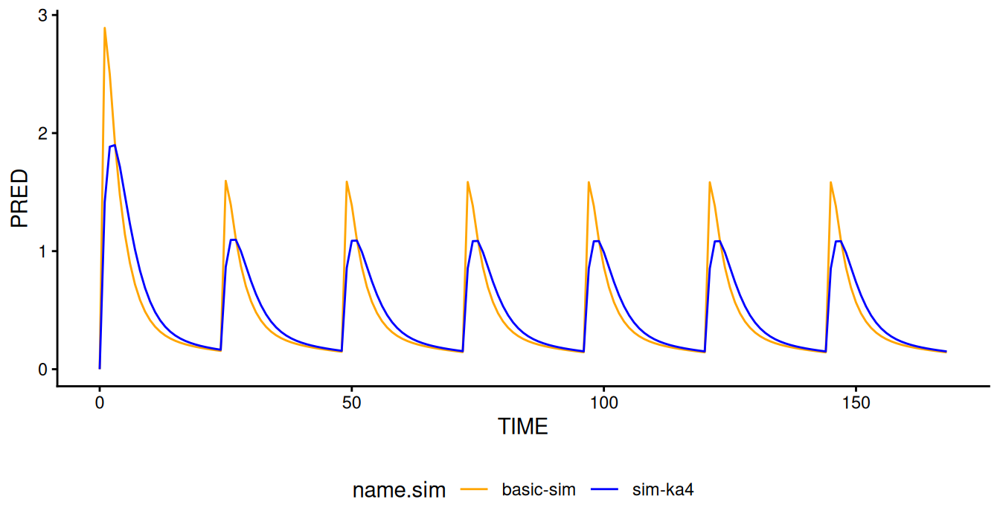

# Simulation with Modifications to Parameters and Model Code

## Introduction

The introduction examples and the other examples show how to perform
various types of simulations, such as typical subject simulations,
simulations of new subjects, simulation of known subjects, and
simulation with parameter uncertainty. As different as these simulations
may be, they are all simulations of a model, exactly as specified or
exactly as estimated. The examples in this document focus on how
modifications to the estimated model can be specified. As will be shown,
NMsim provides very flexible and easy-to-use methods to obtain such
modifications, all contained within the
[`NMsim()`](https://nmautoverse.github.io/NMsim/reference/NMsim.md)
interface itself.

## Objectives

This document aims at enabling you to do the following tasks.

- Control whether and how to update parameter values according to the
  final model parameter estimates using the `inits` argument.

- Modify model parameter values (`$THETA`, `$OMEGA` and `SIGMA`) to
  specify values using the `inits` argument

- Use the `modify` argument to do custom manipulations of any parts of
  the control stream before simulation.

- Modify data exclusions/inclusions (`$IGNORE/$ACCEPT`) using the
  `filters` argument.

- Adjust `$SIZES` variables using the `sizes` argument.

The examples described below use the `modify` argument to modify the
NONMEM control stream and to address the following pharmacometric
questions:

- Modify `KA`: How is the concentration-time profile affected if
  switching formulation (reducing absorption rate) by a range of
  fold-values?
- Modify `F1` and `CL`: What is the expected concentration-time profile
  in patients with a certain Drug-Drug Interaction effect on clearance
  and bioavailability?
- Add `ALAG`: How will a dose delay of different amounts of time affect
  the predicted exposure?
- Add AUC computation in control stream: How can we use NONMEM to
  integrate AUC during model simulation leveraging the benefits of using
  a sparse grid via `NMsim`?

### Prerequisites

To reproduce the examples, you will need to have NMsim configured to
find your Nonmem installation. Also, you should be familiar with how to
use NMsim for running basic simulation workflows. If you need to revisit
those topics, please go to
[`NMsim-intro.html`](https://nmautoverse.github.io/NMsim/articles/NMsim-intro.html).
Especially, it will be helpful to be familiar with simple workflows with
NMsim to understand that certain “model mofifications” such as handling
data sections are done automatically by NMsim, and so methods described
in this document are unnecessary for those.

### Selecting a Model and Generating Simulation Data

``` r
file.mod <- system.file("examples/nonmem/xgxr021.mod",
                        package="NMsim")
data.sim <- NMcreateDoses(TIME=c(0,24),AMT=c(300,150),ADDL=5,II=24,CMT=1) |>
    NMaddSamples(TIME=0:(24*7),CMT=2)
```

### Edit Model Parameters (`inits`)

The `inits` argument is used to control the initial values, or more
accurately all the information in parameter sections of the simulation
control stream, such as `$THETA`, `OMEGA`, `SIGMA`, and even priors if
those are used.

Before doing a simulation, we collect an overview of the parameters in
the estimated model, their initial values as specified in the control
stream, and the estimated values, as read from the `.ext` file. We are
using functions from NMdata to get these. If you are interested in
learning more about these functions, [This NMdata
vignette](https://nmautoverse.github.io/NMsim/articles/) is a good place
to start.

``` r
partab <- NMreadParsText(file.mod,as.fun="data.table",format="%init;%symbol") |>
    mergeCheck(NMreadExt(file.mod),by="parameter",all.x=TRUE,common.cols="drop.y",quiet=TRUE)
partab[,.(par.name,symbol,init,est)]
```

| par.name   | symbol   | init    |         est |
|:-----------|:---------|:--------|------------:|
| THETA(1)   | POPKA    | (0,1)   |   2.1665600 |
| THETA(2)   | POPV2    | (0,100) |  75.7289000 |
| THETA(3)   | POPCL    | (0,3)   |  13.9777000 |
| THETA(4)   | POPV3    | (0,50)  | 150.0600000 |
| THETA(5)   | TVQ      | (0,.5)  |   8.4865100 |
| OMEGA(1,1) | BSV KA   | 0 FIX   |   0.0000000 |
| OMEGA(2,2) | BSV V2   | 0.1     |   0.1786660 |
| OMEGA(3,3) | BSV CL   | 0.1     |   0.2497790 |
| OMEGA(4,4) | BSV V3   | 0 FIX   |   0.0000000 |
| OMEGA(5,5) | BSV Q    | 0 FIX   |   0.0000000 |
| SIGMA(1,1) | Prop Err | 0.1     |   0.0822435 |
| SIGMA(2,2) | Add Err  | 0 FIX   |   0.0000000 |

Let’s run a simple simulation without specifying `inits`.

``` r
simres <- NMsim(file.mod=file.mod,
                data=data.sim,
                name.sim="basic-sim")
```

The following compares the `$THETA`, `$OMEGA`, and `$SIGMA` sections of
the estimated and the simulated control streams side-by-side. The values
have been updated in the simulation control stream (to the right) based
on the `.ext` file (compare to “init” and “est” columns in table above).

    ##     file.mod$THETA                        | simulation$THETA                 
    ## [1] "$THETA  (0,1)             ; POPKA"   - "$THETA (0,2.16656)  ; POPKA" [1]
    ## [2] "$THETA  (0,100)             ; POPV2" - "$THETA (0,75.7289)  ; POPV2" [2]
    ## [3] "$THETA  (0,3)             ; POPCL"   - "$THETA (0,13.9777)  ; POPCL" [3]
    ## [4] "$THETA  (0,50)             ; POPV3"  - "$THETA (0,150.06)   ; POPV3" [4]
    ## [5] "$THETA  (0,.5)             ; TVQ"    - "$THETA (0,8.48651)  ; TVQ"   [5]
    ## 
    ##     file.mod$OMEGA           | simulation$OMEGA               
    ## [1] "$OMEGA 0 FIX  ; BSV KA" - "$OMEGA 0 FIX     ; BSV KA" [1]
    ## [2] "$OMEGA 0.1   ; BSV V2"  - "$OMEGA 0.178666  ; BSV V2" [2]
    ## [3] "$OMEGA 0.1  ; BSV CL"   - "$OMEGA 0.249779  ; BSV CL" [3]
    ## [4] "$OMEGA 0 FIX ; BSV V3"  - "$OMEGA 0 FIX     ; BSV V3" [4]
    ## [5] "$OMEGA 0 FIX  ; BSV Q"  - "$OMEGA 0 FIX     ; BSV Q"  [5]
    ## 
    ## `file.mod$SIGMA`:   "$SIGMA 0.1  ; Prop Err"       "$SIGMA 0 FIX ; Add Err"     
    ## `simulation$SIGMA`: "$SIGMA 0.0822435  ; Prop Err" "$SIGMA 0 FIX      ; Add Err"

To simulate the model without updating the parameters based on final
model estimates, use `inits=list(method="none")`.

We may want to customly specify individual parameter values. Let’s now
do rerun the simulation adding some custom values for `THETA(1)` and
`OMEGA(3,3)`. Since we are not using `inits=list(method="none")` all
other parameter values are updated with final estimates.

``` r
simres.inits1 <- NMsim(file.mod=file.mod,
                       data=data.sim,
                       inits=list("theta(1)"=list(init=0.54)
                                 ,"omega(3,3)"=list(init=.5)
                                  ),
                       name.sim="inits1")
```

    ##     file.mod$THETA                        | simulation$THETA                 
    ## [1] "$THETA  (0,1)             ; POPKA"   - "$THETA (0,0.54)     ; POPKA" [1]
    ## [2] "$THETA  (0,100)             ; POPV2" - "$THETA (0,75.7289)  ; POPV2" [2]
    ## [3] "$THETA  (0,3)             ; POPCL"   - "$THETA (0,13.9777)  ; POPCL" [3]
    ## [4] "$THETA  (0,50)             ; POPV3"  - "$THETA (0,150.06)   ; POPV3" [4]
    ## [5] "$THETA  (0,.5)             ; TVQ"    - "$THETA (0,8.48651)  ; TVQ"   [5]
    ## 
    ##     file.mod$OMEGA           | simulation$OMEGA               
    ## [1] "$OMEGA 0 FIX  ; BSV KA" - "$OMEGA 0 FIX     ; BSV KA" [1]
    ## [2] "$OMEGA 0.1   ; BSV V2"  - "$OMEGA 0.178666  ; BSV V2" [2]
    ## [3] "$OMEGA 0.1  ; BSV CL"   - "$OMEGA 0.5       ; BSV CL" [3]
    ## [4] "$OMEGA 0 FIX ; BSV V3"  - "$OMEGA 0 FIX     ; BSV V3" [4]
    ## [5] "$OMEGA 0 FIX  ; BSV Q"  - "$OMEGA 0 FIX     ; BSV Q"  [5]
    ## 
    ## `file.mod$SIGMA`:   "$SIGMA 0.1  ; Prop Err"       "$SIGMA 0 FIX ; Add Err"     
    ## `simulation$SIGMA`: "$SIGMA 0.0822435  ; Prop Err" "$SIGMA 0 FIX      ; Add Err"

For simulation purposes, the initial value is probably going to be the
only property of a parameter that needs to be controlled. For other
purposes like estimation or optimal sampling, properties such as “FIX”,
lower and upper limits may also need to be modified. `inits` supports
modification of any subset of these values. This would remove “FIX” and
include bounds like `(0,0.54,10)`:

``` r
simres.inits1b <- NMsim(file.mod=file.mod,
                        data=data.sim,
                        inits=list("theta(1)"=list(init=0.54,lower=0,upper=10,FIX=0)),
                        name.sim="inits1b")
```

The `inits` argument provides multiple interfaces to specification of
parameter values. The one used above is simple and easy for a few
parameter specifications. You can also maintain a `data.frame` of
parameters using (any subset of) columns named `init`, `FIX`, `lower`,
`upper`. This may be more convenient for programming. Pass this as

``` r
inits=lists(inits.tab=my.df)
```

Also, you can use a specific format table used to represent parameter
values, as obtained by
[`NMdata::NMreadExt()`](https://nmautoverse.github.io/NMdata/reference/NMreadExt.html).
Read the parameters, modify, apply (here, adding 30% to `THETA(1)`):

``` r
myext <- NMreadExt(file.mod)
myext[myext$parameter=="THETA(1)",value=value*1.3]

simres.inits1c <- NMsim(file.mod=file.mod,
                        data=data.sim,
                        inits=list(ext=myext),
                        name.sim="inits1c")
```

## Edit the Control Stream Text (`modify`)

While `inits` modifies parameter values (and other parameter
properties), `modify` edits the control stream text directly. This is a
powerful alternative because it can allow for modifications independent
of parameter numbering, and the model can be modified very freely.

### Example (`modify`): Change in formulation

This example edits the `$PK` section of an estimated Nonmem model to
adjust the model variable `KA`. Imagine we are considering a new
formulation, and we want to simulate how a four-fold faster absorption
would impact exposure. A simple way to do that is to add a line
`KA=KA/4` to the `$PK` section. Easy:

``` r
simres.ka4 <- NMsim(file.mod=file.mod,
                    data=data.sim,
                    name.sim="sim-ka4",
                    modify=list(PK=NMsim::add("KA=KA/4"))
                    )
```

``` r
simres.ka4 <- NMreadSim("simres-modify/xgxr021_simka4_MetaData.rds")
```

Notice how the difference from the original simulation is that the
control stream has a new line in `$PK` reading exactly `KA=KA/4`. This
method works on the PK section alone and is independent of what `THETA`
and `OMEGA` parameters are related to `KA`.

``` r
my.file.diff(modTab(simres)$path.sim,
             modTab(simres.ka4)$path.sim,sections="PK",
             x_arg="basic-sim",y_arg="sim-ka4")
```

    ##      basic-sim$PK          | sim-ka4$PK                
    ## [10] "V3=TVV3*EXP(ETA(4))" | "V3=TVV3*EXP(ETA(4))" [10]
    ## [11] "Q=TVQ*EXP(ETA(5))"   | "Q=TVQ*EXP(ETA(5))"   [11]
    ## [12] "S2=V2"               | "S2=V2"               [12]
    ##                            - "KA=KA/4"             [13]

The `modify` argument takes a list, where each element is named as the
control stream section to be modified, in this case `$PK`. It can be - A
character vector: the entire secion is overwritten - A function: The
function is applied to the section text

In this case we used a function provided by NMsim called
[`add()`](https://nmautoverse.github.io/NMsim/reference/add.md). This
function actually returns a function which is a little complicated but
serves the purpose of this example. The function it returns appends
`KA=KA/4` to whatever character vector it receives. It would be
equivalent to do

``` r
simres.ka4 <- NMsim(file.mod=file.mod,
                    data=data.sim,
                    name.sim="sim-ka4",
                    ## equivalent to
                    ## modify=list(PK=NMsim::add("KA=KA/4"))
                    modify=list(PK=function(...)(c(...,"KA=KA/4")))
                    )
```

[`NMsim::add()`](https://nmautoverse.github.io/NMsim/reference/add.md)
may be a little easier to write and read. It can also prepend text, see
the `pos` argument. There is also a function called
[`NMsim::overwrite()`](https://nmautoverse.github.io/NMsim/reference/overwrite.md)
which can replace text strings. Once you try this one or two times, you
will hopefully appreciate how easily you can tweak control streams to do
what you need, still benifiting from
[`NMsim()`](https://nmautoverse.github.io/NMsim/reference/NMsim.md)’s
handling of data, automated control stream generation etc.

Let’s compare the two simulation results. The absorption was slowed as
expected.

``` r
rbind(simres,simres.ka4) |>
    ggplot(aes(TIME,PRED,colour=name.sim))+
    geom_line()
```



### Controlling Variables Using The Simulation Data Set

In the previous example `KA` was scaled by 4 by specicification in the
[`NMsim()`](https://nmautoverse.github.io/NMsim/reference/NMsim.md)
call. The following example uses a column in the simulation data set to
scale the `KA` value. This allows for a more flexible exploration of the
effect of different values of `KA`.

The effect on the concentration-time profile of a change in formulation
that reduces absorption rate `KA` is explored with the use of a scaling
factor `KASCALE` included to the NONMEM control stream via the `modify`
argument. The values of `KASCALE` are provided through the `NMsim`
simulation data `dat.sim.varka` containing dosing events. We simulate
three distinct subjects, each with their own `KASCALE` value. `KASCALE`
values 1, 4, and 10 are used, corresponding to an unchanged KA, a
4-fold, and a 10-fold larger KA. We will be looking at `PRED` (of
concentrations) so this is effectively a typical subject analysis.

First `KASCALE` is added to the simulation data by repeating the data
set three for each value of `KASCALE`, and redefining `ID` to be
distinct for each value of `KASCALE`. The code below uses `data.table`
but any data manipulation tool (such as base R or dplyr) could be used.

``` r
# add KASCALE and copy patient info for each value of KASCALE
dat.sim.varka <- data.sim[,data.table(KASCALE=c(1,4,10)),by=data.sim] 
dat.sim.varka[,ID:=.GRP,by=.(KASCALE,ID)] # update patient IDs
setorder(dat.sim.varka,ID,TIME,EVID) # order rows
```

Then the
[`NMsim()`](https://nmautoverse.github.io/NMsim/reference/NMsim.md)
function is used to run the simulation in which the `modify` argument is
used to simulate a modified model with different absorption rates,
scaled by the parameter `KASCALE`. Two different approaches are
demonstrated:

1.  the effect of the scaling factor `KASCALE` is added at the end of
    the `PK` section in the NONMEM control stream.

``` r
simres.varka <- NMsim(file.mod=file.mod # NONMEM control stream
                     ,data=dat.sim.varka # simulation data file
                     ## ,name.sim="varka"
                     ,name.sim="add(): Append KA/KASCALE"
                     ,modify=list(PK=add("KA=KA/KASCALE")))
```

2.  the specific line that defines `TVKA` is modified to include the
    effect of the scaling factor `KASCALE`. This is done for
    illustration of `overwrite`, see the `inits` argument for how to
    edit parameter values directly.

``` r
simres.varka2 <- NMsim(file.mod=file.mod
                      ,data=dat.sim.varka
                       ##,name.sim="varka2"
                      ,name.sim="overwrite(): Replace THETA(1) by THETA(1)/KASCALE"
                      ,modify=list(PK=overwrite("THETA(1)","THETA(1)/KASCALE"))
                       )
```

The code below returns the plot

``` r
simres.both <- rbind(simres.varka,
                     simres.varka2)

ggplot(simres.both[EVID==2],aes(TIME,PRED,colour=factor(KASCALE)))+
    geom_line()+
    labs(colour="Fold absorption prolongation, KASCALE")+
    scale_x_continuous(breaks=seq(0,168,by=24))+
    facet_wrap(~name.sim)+
    scale_color_manual(values=c("orange", "blue", "darkgreen"))
```


Concentration (`PRED`) profile as a function of time computed by `NMsim`
modified models **a** (left) and **b** (right). The equivalence and
robustness of the two modified models is supported by the matching
results, corresponding to reduced `PRED` values for higher values of
`KASCALE` (lower absorption rate).

## Additional `modify` Examples

`modify` example: Drug-Drug Interaction (DDI)

The effect of DDI on clearance (`CL`) and bioavailability (`F1`) is
simulated for the following scenarios

| scenario | CLSCALE | FSCALE | CLSCALE/FSCALE |
|:---------|:--------|:-------|:---------------|
| noDDI    | 1       | 1      | 1              |
| DDI.1    | 0.5     | 1.2    | 0.42           |
| DDI.2    | 0.33    | 1.1    | 0.3            |

First the `CL` and `F1` data is added to the patient data

``` r
## 'Outer join'
dat.sim.DDI=data.sim[,data.table(CLSCALE=c(1,1/2,1/3)
                                ,FSCALE=c(1,1.2,1.1)
                                ,lab=c("noDDI","DDI.1","DDI.2"))
                    ,by=data.sim]
dat.sim.DDI[,ID:=.GRP,by=.(lab,ID)]
setorder(dat.sim.DDI,ID,TIME,EVID)
```

Then, the DDI driven change in parameters is added at the end of the PK
section of the NONMEM control stream via the `modify` argument in the
[`NMsim()`](https://nmautoverse.github.io/NMsim/reference/NMsim.md)
function.

``` r
simres.DDI <- NMsim(file.mod=file.mod
                   ,data=dat.sim.DDI
                   ,name.sim="DDI"
                   ,modify=list(PK=add("CL=CL*CLSCALE"
                                      ,"F1=FSCALE")))
```

The effect on the concentration-time profile is shown in the figure
below


Concentration (`PRED`) profile as a function of time computed by `NMsim`
modified model for different DDIs. The modified model correctly
simulates (i) a higher value of `Cmax` on day 1 for higher
biovalability; (ii) a higher `PRED` value at steady state for lower
apparent clearance effect `CLSCALE/FSCALE` values.

`modify` example: Conditional Dose Delay

Deviations in the administration schedule of a drug are simulated
including three parameters in the dataset: the dose number `DOSCUMN`,
obtained with
[`NMdata::addTAPD()`](https://nmautoverse.github.io/NMdata/reference/addTAPD.html),
the specific number of the delayed dose `DELAYDOS` and the time delay
`ALAG`.

``` r
dat.sim.alag = data.sim |> NMexpandDoses() |> addTAPD() # expand doses and add dose number
dat.sim.alag[,ROW:=.I] # restore ROW with correct value
                                        # add delayed dose
dat.sim.dos.delay=dat.sim.alag[,data.table(DELAYDOS=c(2,3,4,5,6,7))
                              ,by=dat.sim.alag]
                                        # add dose delay 
dat.sim.alag.final=dat.sim.dos.delay[,data.table(ALAG=c(0,6,12,18,24))
                                    ,by=dat.sim.dos.delay]
                                        # update ID 
dat.sim.alag.final[,ID:=.GRP,by=.(ALAG,DELAYDOS,ID)]
setorder(dat.sim.alag.final,ID,TIME,EVID)
                                        #dat.sim.alag.final = dat.sim.alag.final |> fill(DOSCUMN)
```

The following patient has a 6 hours delay to the administration of dose
2.

| TIME | AMT | DOSCUMN | DELAYDOS | ALAG |
|-----:|----:|--------:|---------:|-----:|
|    0 | 300 |       1 |        2 |    6 |
|   24 | 150 |       2 |        2 |    6 |
|   48 | 150 |       3 |        2 |    6 |
|   72 | 150 |       4 |        2 |    6 |
|   96 | 150 |       5 |        2 |    6 |
|  120 | 150 |       6 |        2 |    6 |
|  144 | 150 |       7 |        2 |    6 |

The time delay is included in the modified control stream with `NMsim`
adding a single line at the end of the PK section, where the dose delay
on compartment 1 `ALAG1` is modified for the dose with dose number
`DOSCUMN` equal to the target delayed dose number `DELAYDOS`

``` r
simres.alag <- NMsim(file.mod=file.mod
                    ,data=dat.sim.alag.final
                    ,name.sim="alag"
                    ,modify=list(PK=
                                     add("IF(DOSCUMN.EQ.DELAYDOS) ALAG1=ALAG")))
```

The effect on concentration-time profiles and daily AUC are shown in the
two images below.


Effect of time delay (0, 12 and 24 hours on dose 2) on concentration
(`PRED`) profile as a function of time computed by `NMsim` modified
model. The implementation of the modified model simply consists of the
addition of the variables `DOSCUMN`, `DELAYDOS`, and `ALAG` to the
original data set, and the addition of one line of code to the PK
section of the control stream via `modify`.


Daily exposure on day 3 as a function of time delay for dose 2 (left)
and dose 3 (right). The simulation results predict an increased risk for
possible safety concerns (left panel, over-exposure) and loss of
efficacy (right panel, under-exposure) as dose time delay gets larger.

`modify` example: Calculation of AUC

The following example computes daily exposure:

- at post-processing, using trapezoidal method, after the unmodified
  NONMEM model is simulated on three different fine grids with evenly
  spaced time steps of `0.25`, `1`, and `4` hours, respectively,
  labelled **AUC trapez**

``` r
file.mod.auc <- system.file("examples/nonmem/xgxr046.mod",
                            package="NMsim")
data.sim.auc <- NMreadCsv(system.file("examples/derived/dat_sim1.csv",
                                      package="NMsim"))
data.sim.auc[,AMT:=1000*AMT]

                                        # time step 1hr
data.sim.1hr=data.sim.auc
data.sim.1hr[,TSTEP:="1hr"]

                                        # time step 0.25hr
data.sim.0.25hr=addEVID2(data.sim.auc[EVID==1],CMT=2,time.sim=seq(0,192,by=0.25))
data.sim.0.25hr[,TSTEP:="0.25hr"]

                                        # time step 4hr
data.sim.4hr <- addEVID2(data.sim.auc[EVID==1],CMT=2,time.sim=seq(0,192,by=4))
data.sim.4hr[,TSTEP:="4hr"]

sres.trapez <- NMsim(file.mod=file.mod.auc
                    ,data=list(data.sim.1hr # run NMsim on a list of data sets to run all different scenarios at once
                              ,data.sim.0.25hr
                              ,data.sim.4hr)
                    ,seed=12345
                    ,table.vars=cc(PRED,IPRED)
                    ,name.sim="AUC.trapez"
                    ,reuse.results=reuse.results
                     )

                                        # daily AUC computation
sim.auc=sres.trapez[EVID==2,.(ID,TIME,PRED,time.step=TSTEP)] 
sim.auc[,DAY:=(TIME%/%24)+1] # define DAY variable
                                        # create duplicate time steps for end-of-day
                                        # (e.g 24h belongs to both day 1 and day2)
sim.dupli.24h=sim.auc[TIME%%24==0 & TIME>0,.(ID
                                            ,DAY=DAY-1
                                            ,TIME
                                            ,PRED
                                            ,time.step)]
sim.auc.final <- rbind(sim.auc
                      ,sim.dupli.24h) |> setorder(ID,DAY,TIME,time.step)

sim.auc.trapez<-sim.auc.final[DAY<8,.(AUC=NMcalc::trapez(TIME,PRED))
                             ,by=.(ID,DAY,time.step)]
                                        # stmp=sres1[EVID==2,.(ID,TIME,PRED)]
                                        # stmp[,DAY:=(TIME%/%24)+1]
                                        # sAUC<-stmp[,.(AUC=NMcalc::trapez(TIME,PRED)),by=.(ID,DAY)]
```

- at run time, with an `NMsim` modified script, on a course grid with
  evenly spaced time steps of `24` hours, labelled **AUC \$DES**. Of
  note, this task requires additions to the control stream in multiple
  sections.

``` r
# AUC with NMsim -  time step 24hr
data.sim2 <- addEVID2(data.sim.auc[EVID==1],CMT=2,time.sim=seq(0,by=24,length.out=9))

sres.des <- NMsim(file.mod=file.mod.auc
                 ,data=data.sim2
                 ,table.vars=cc(PRED,IPRED,AUCNMSIM)
                 ,name.sim="AUC.nmsim"
                 ,seed=12345
                 ,reuse.results=reuse.results
                 ,modify=list(MODEL=add("COMP=(AUC)")
                             ,DES=add("DADT(3)=A(2)/V2")
                             ,ERROR=add("AUCCUM=A(3)"
                                       ,"IF(NEWIND.NE.2) OLDAUCCUM=0"
                                       ,"AUCNMSIM = AUCCUM-OLDAUCCUM"
                                       ,"OLDAUCCUM = AUCCUM")))

sres.des[,DAY:=TIME%/%24]
sres.des[,AUC.NMsim:=AUCNMSIM]
sres.auc.des=sres.des[AUCNMSIM!=0,.(TIME,DAY,PRED,AUC.NMsim)]
```

The plot comparing the `DES` and `trapez` AUC is obtained with the code
below

``` r
sres.final=mergeCheck(sim.auc.trapez[,.(DAY,AUC,time.step)]
                     ,sres.auc.des[,.(DAY,AUC.NMsim)]
                     ,by="DAY")

ggplot(data=sres.final,aes(AUC.NMsim,AUC,colour=factor(time.step)))+
    geom_point(size=4)+
    labs(colour="Time step in fine grid")+
    scale_color_manual(values=c("orange", "blue", "darkgreen"))+
    xlim(c(0,17))+
    ylim(c(0,17))+
    ylab("AUC 0-24h by trapez method, on fine grid")+
    xlab("AUC 0-24h by integration through $DES, on coarse grid")+
    geom_abline(slope=1, intercept=0)
```


Daily exposures computed at run time (\$DES, coarse grid, x-axis) and
post-processing time (`trapez`, fine grids, y-axis). AUC (trapez)
converges to the value computed with \$DES method as the time step is
reduced. Includes identity line.

## Modify `$SIZES` using `sizes`

For some NONMEM runs (simulations) it may be necessary to modify
`$SIZES`. Remember that the simulation control stream is derived based
on the estimation control stream, and so if `$SIZES` settings are found
in the estimation control stream, those will by default also be in the
simulation control stream generated by
[`NMsim()`](https://nmautoverse.github.io/NMsim/reference/NMsim.md). The
`sizes` argument is hence only needed if the simulation `$SIZES`
variables need to be different from those used during estimation. This
will typically be the case due to properties of the simulation data.
[`NMsim()`](https://nmautoverse.github.io/NMsim/reference/NMsim.md) by
default calls NONMEM with options that should help guessing some of
these options automatically, but here is how to do it if that fails.

`sizes` is very simple to use. As an example, this
[`NMsim()`](https://nmautoverse.github.io/NMsim/reference/NMsim.md) call
sets `$SIZES PD=100 LTV=70`

``` r
simres <- NMsim(file.mod=file.mod,
                data=data.sim,
                sizes=list(PD=100,LTV=70),
                name.sim="sim-sizes")
```

`sizes` by default only overwrites matching `$SIZES` variables. If
`$SIZES` already contained other variables than in this case `PD` and
`LTV`, those would be left untouched. If you want to write the `$SIZES`
section from scratch, add `wipe=TRUE`:

``` r
simres <- NMsim(file.mod=file.mod,
                data=data.sim,
                sizes=list(PD=100,LTV=70,wipe=TRUE),
                name.sim="sim-sizes")
```

## Modify `ACCEPT`/`IGNORE` Using `filters`

The `filters` argument is an interface to control the `ACCEPT` and
`IGNORE` (inclusion/exclusion) statements in NONMEM. This can be but is
rarely used for simulation because the simulation data set is normally
filtered for the simulation purpose. The common exception is for
simlation of VPC. To avoid duplication of examples, please refer to

[VPC
Simulations](https://nmautoverse.github.io/NMsim/articles/NMsim-VPC.html#change-the-acceptignore-statements)
